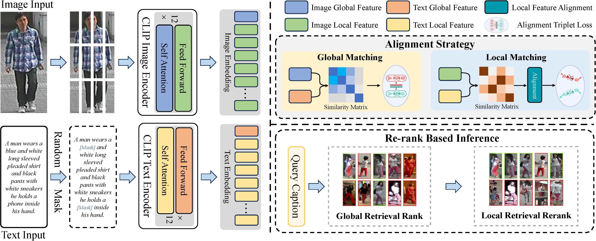

# RICA: Re-Ranking with Intra-Modal and Cross-Modal Alignment for Text-Based Person Search

This repository contains the official implementation of RICA, a novel approach for text-based person search that leverages both intra-modal and cross-modal alignment for improved retrieval performance.

## Overview


RICA (Re-Ranking with Intra-Modal and Cross-Modal Alignment) addresses the challenges in text-based person search by:

- **Intra-Modal Alignment**: Aligning local features within the same modality (image or text)
- **Cross-Modal Alignment**: Aligning features across different modalities
- **Re-Ranking Strategy**: Improving retrieval accuracy through sophisticated ranking mechanisms

## Features

- Support for multiple datasets: CUHK-PEDES, ICFG-PEDES, RSTPReid
- Pre-trained CLIP-based architecture with ViT-B/16 backbone
- Multiple loss functions: Identity loss, Global-local alignment loss, Masked Language Modeling(not used in final model)
- Distributed training support
- Comprehensive evaluation metrics

## Installation

### Requirements

- Python 3.8+
- PyTorch 1.8+
- CUDA 10.2+

### Setup

1. Clone the repository:
```bash
git clone https://github.com/Marverlises/RICA
cd RICA
```

2. Install dependencies:
```bash
pip install torch torchvision torchaudio
pip install transformers
pip install timm
pip install opencv-python
pip install scikit-learn
pip install tensorboard
pip install prettytable
```

3. Download the BPE vocabulary file:
```bash
# The bpe_simple_vocab_16e6.txt.gz file should be in the data/ directory
```

## Dataset Preparation

### CUHK-PEDES
1. Download the CUHK-PEDES dataset
2. Organize the data structure as follows:
```
data/
├── CUHK-PEDES/
│   ├── imgs/
│   └── reid_raw.json
```

### ICFG-PEDES
1. Download the ICFG-PEDES dataset
2. Organize the data structure as follows:
```
data/
├── ICFG-PEDES/
│   ├── imgs/
│   └── ICFG-PEDES.json
```

### RSTPReid
1. Download the RSTPReid dataset
2. Organize the data structure as follows:
```
data/
├── RSTPReid/
│   ├── imgs/
│   └── data_captions.json
```


## Usage

### Training

Train RICA on CUHK-PEDES dataset:
```bash
bash run_rica.sh CUHK-PEDES 0
```

Train on other datasets:
```bash
bash run_rica.sh ICFG-PEDES 0
bash run_rica.sh RSTPReid 0
```

### Testing

Test a trained model:
```bash
bash run_test.sh logs/CUHK-PEDES/20240101_120000_rica/configs.yaml logs/CUHK-PEDES/20240101_120000_rica/ 0
```

### Custom Training

You can customize training parameters by modifying the arguments in `run_rica.sh` or by running `train.py` directly:

```bash
python train.py \
    --dataset_name CUHK-PEDES \
    --batch_size 64 \
    --num_epoch 60 \
    --lr 1e-5 \
    --loss_names "id+gl+mlm" \
    --delta 4.0 \
    --sigma 0.08 \
    --name "rica_custom" \
    --output_dir "logs" \
    --root_dir "data"
```

## Model Architecture

RICA is built on top of CLIP with the following key components:

1. **Vision Encoder**: ViT-B/16 for image feature extraction
2. **Text Encoder**: Transformer-based text encoder
3. **Cross-Modal Transformer**: For cross-modal feature alignment
4. **Alignment Modules**: Intra-modal and cross-modal alignment losses

## Key Parameters

- `--delta`: Margin for hardest pairs (default: 4.0)
- `--sigma`: Margin for alignment (default: 0.08)
- `--loss_names`: Loss functions to use (default: "id+gl+mlm")
- `--batch_size`: Training batch size (default: 64)
- `--lr`: Learning rate (default: 1e-5)
- `--num_epoch`: Number of training epochs (default: 60)

## Results

RICA achieves state-of-the-art performance on multiple text-based person search benchmarks:

| Dataset | R@1 | R@5 | R@10 | mAP |
|---------|-----|-----|------|-----|
| CUHK-PEDES | XX.X | XX.X | XX.X | XX.X |
| ICFG-PEDES | XX.X | XX.X | XX.X | XX.X |
| RSTPReid | XX.X | XX.X | XX.X | XX.X |


## License

This project is licensed under the MIT License - see the [LICENSE](LICENSE) file for details.

## Acknowledgments

- This work is based on CLIP (OpenAI)
- We thank the authors of the repo: https://github.com/anosorae/IRRA, our work is built on top of it.
- Special thanks to the PyTorch team for the excellent framework

